# Visual Analytics of LinkedIn Job Postings


---

## 👥 Group Information

| Name | Email |
|------|-------|
| Sunil Kuruba | skuru@uic.edu |
| Richa Rameshkrishna | rrame11@uic.edu |

---

## 📋 Table of Contents
1. [Overview](#overview)
2. [Dataset](#dataset)
3. [Project Structure](#project-structure)
4. [Assignment 1: Dataset Selection & Preprocessing](#assignment-1-dataset-selection--preprocessing)
5. [Assignment 2: Visualization Design & Sketching](#assignment-2-visualization-design--sketching)
6. [Assignment 3: Static & Interactive Visualizations](#assignment-3-static--interactive-visualizations)
7. [Assignment 4: Linked Views & Spatial Analysis](#assignment-4-linked-views--spatial-analysis)
8. [Assignment 5: Dimensionality Reduction & Web Application](#assignment-5-dimensionality-reduction--web-application)
9. [Technologies](#technologies)
10. [How to Run](#how-to-run)
11. [Key Insights](#key-insights)
12. [References](#references)

---

## 🎯 Overview

This project performs comprehensive visual analytics on LinkedIn job postings data across five progressive assignments, exploring temporal trends, skill demands, geographic patterns, interactive dashboards, and machine learning-powered embedding visualizations. The project demonstrates the full pipeline of data visualization: from dataset selection and cleaning, through exploratory sketching and static visualizations, to interactive linked views, spatial analysis, and finally dimensionality reduction with an interactive web application.

**Key Analysis Areas:**
- **Temporal trends** in hiring patterns and seasonal variations
- **Skill demand** across industries, roles, and experience levels
- **Salary distributions** by geography, experience level, and work type
- **Geographic patterns** in job markets across US states
- **Interactive dashboards** with coordinated selections and linked views
- **Dimensionality reduction** using PCA, t-SNE, and UMAP for job similarity visualization

---

## 📊 Dataset

**Source:** [LinkedIn Job Postings - Kaggle](https://www.kaggle.com/datasets/arshkon/linkedin-job-postings/data)

The LinkedIn Job Postings dataset provides a comprehensive view of more than **124,000 job postings** spanning **2023 and 2024**, enriched with detailed company, skill, industry, salary, and benefits information. Each posting includes attributes such as job title, description, posting time, work type (remote, hybrid, full-time, contract), and application links. Complementary tables add depth by linking postings to company data (including company size, employee and follower counts, and headquarters location), skill requirements, and industry categories.

### Why This Dataset?

#### 1. Rich & Multi-Dimensional Data
The dataset doesn't just provide job postings but also includes benefits, skills, industries, and company details, enabling multi-layered visualizations that connect jobs, companies, and skills together.

#### 2. Trend Analysis
Spanning 2023 and 2024, the data enables exploration of time-based changes like hiring surges, seasonal variations, and remote job growth.

#### 3. Geographic Visualizations
Detailed location data (city, state, country, zip) allows mapping of job concentrations and exploration of remote work distribution geographically.

#### 4. Salary, Company & Skills - Combined Visualization Potential
- **Salary & Compensation:** Min, median, and max salary fields enable comparison across roles, companies, and regions
- **Company-Level Analysis:** Company size and follower counts reveal how hiring differs between startups and enterprises
- **Skills & Benefits:** Separate skill/benefit files highlight what companies value most

#### 5. Broad Audience Appeal
In the era of AI disruption in the job market, this analysis helps students and professionals understand hiring trends, skills in demand, and opportunities aligned with career goals.

### Dataset Schema

Each record corresponds to one job listing, including:
- **Job details:** `title`, `description`, `work_type`, `company_name`
- **Compensation:** `min_salary`, `med_salary`, `max_salary`, `pay_period`
- **Experience level:** `formatted_experience_level`
- **Location:** `state`, `zip_code`
- **Engagement metrics:** `views`, `applies`
- **Posting details:** `listed_time`, `remote_allowed`, `application_type`

---

## 📁 Project Structure

```
linkedin-job-analytics/
├── README.md
├── requirements.txt
├── data/
│   ├── postings.csv
│   ├── data_science_job_posts_2025.csv
│   ├── data_science_job_posts_2025_clean.csv
│   └── data_science_job_posts_2025_embeddings.csv
├── notebooks/
│   ├── 01-data-preprocessing.ipynb
│   ├── 02-exploratory-visualizations-a.ipynb
│   ├── 02-exploratory-visualizations-b.ipynb
│   ├── 03-interactive-visualizations.ipynb
│   ├── 1-Linked-view-visualizations.ipynb
│   ├── 2-Spatial-visualization.ipynb
│   ├── 3-Linked-spatial-visualization.ipynb
│   ├── Task_1.ipynb
│   ├── Task_2.ipynb
│   ├── Task_3.ipynb
│   ├── 0_Data_cleaning.ipynb
│   ├── 1_Generate_Embedding.ipynb
│   ├── 2_TSNE_and_UMAP.ipynb
│   └── 3_PCA.ipynb
├── sketches/
│   ├── Q1a.png
│   ├── Q1b.png
│   ├── Q2a.png
│   ├── Q2b.png
│   ├── Q3a.png
│   ├── Q3b.png
│   ├── 1-monthly-trend.svg
│   ├── 2-skill-demand-industry-role.svg
│   ├── 3-1-skill-demand.svg
│   ├── 3-2-skill-demand.gif
│   ├── 4-1-salary-median.svg
│   ├── 4-2-salary-median.gif
│   ├── Bubble.gif
│   ├── Heat.gif
│   ├── Box.gif
│   ├── task1-v1-skill-vs-salary.gif
│   ├── Task_2_richa.gif
│   └── ... (all visualizations)
└── web-app/
    ├── index.html
    ├── script.js
    └── styles.css
```

---

## 📚 Assignment 1: Dataset Selection & Preprocessing

**Notebook:** `01-data-preprocessing.ipynb`

### Dataset Selection Process

Our group explored multiple platforms to identify a dataset relevant to real-world issues and suitable for analysis. We searched:
- **Government repositories:** Chicago Open Data Portal, NYC Open Data (Richa)
- **Community platforms:** Kaggle across healthcare, finance, social sciences (Sunil)

**Evaluation criteria:**
1. Real-world applicability
2. Sufficient size for meaningful analysis
3. Novelty to avoid overly common topics

**Datasets considered but rejected:**
- **COVID-19 datasets:** Too heavily analyzed, lacks distinctiveness
- **Job application portal data:** Too small, insufficient detail

### Data Cleaning and Preprocessing

The script loads, profiles, and cleans the dataset in a structured and reproducible way:

**Key preprocessing tasks:**
- **State Extraction:** Uses regular expressions to extract U.S. state abbreviations from `headquarter` column and maps to FIPS codes
- **Salary Parsing:** Converts salary text ranges (e.g., "$80K–$120K") into numeric midpoints
- **Salary Normalization:** Converts all salaries to annual equivalents using pay period conversion factors:
  - `HOURLY`: × 2,080 (40 hours × 52 weeks)
  - `WEEKLY`: × 52
  - `BIWEEKLY`: × 26
  - `MONTHLY`: × 12
  - `YEARLY`: × 1
- **Seniority Normalization:** Cleans and standardizes `seniority_level` to lowercase values
- **Skills Parsing:** Transforms stringified skill lists into clean Python lists by stripping brackets, quotes, and whitespace
- **Deduplication:** Removes duplicate job postings using key columns

**Output:** Clean dataset saved as `data_science_job_posts_2025_clean.csv`

---

## 🎨 Assignment 2: Visualization Design & Sketching

**Notebooks:** 
- `02-exploratory-visualizations-a.ipynb`
- `02-exploratory-visualizations-b.ipynb`

### Domain Questions

#### Question 1: How have job postings trended over time (2023–2024)? Which industries are generating the most job postings?

By aggregating postings across months using `original_listed_time`, we explore seasonal peaks, steady growth, or unexpected dips. Combined with industry-level analysis using `job_industries.csv`, we identify which sectors are expanding, stable, or contracting.

#### Question 2: What skills are most in demand, and which skills are frequently listed together?

Using `job_skills.csv` and `mappings/skills.csv`, we measure skill frequency and break them down by industry or seniority level. Co-occurrence analysis reveals natural skill bundles like Python, SQL, and AWS.

#### Question 3: How do salaries differ across industries, company size, and company state?

Linking `jobs/salaries.csv` with company attributes like `employee_counts.csv` and geographic details, we compare compensation trends to assess how industry domain, organizational scale, and geography shape pay expectations.

#### Question 4: How does the availability of high-paying, remote jobs spread geographically over time?

Investigating whether remote opportunities first appear in tech hubs and gradually expand to secondary metropolitan areas, using `location`, `remote_allowed`, `normalized_salary`, and `listed_time`.

#### Question 5: Is there a relationship between a company's popularity and salary disclosure?

Exploring whether well-known companies rely on brand recognition to attract applicants without salary transparency.

#### Question 6: What is the salary premium for higher experience levels? Does it vary across industries?

Analyzing how compensation scales with experience and whether certain industries offer steeper salary growth curves.

### Visualization Sketches

All sketches are located in the `sketches/` directory.

#### Sketch 1 & 2: Job Posting Trends Over Time

**Sketch 1 (Line Chart):** 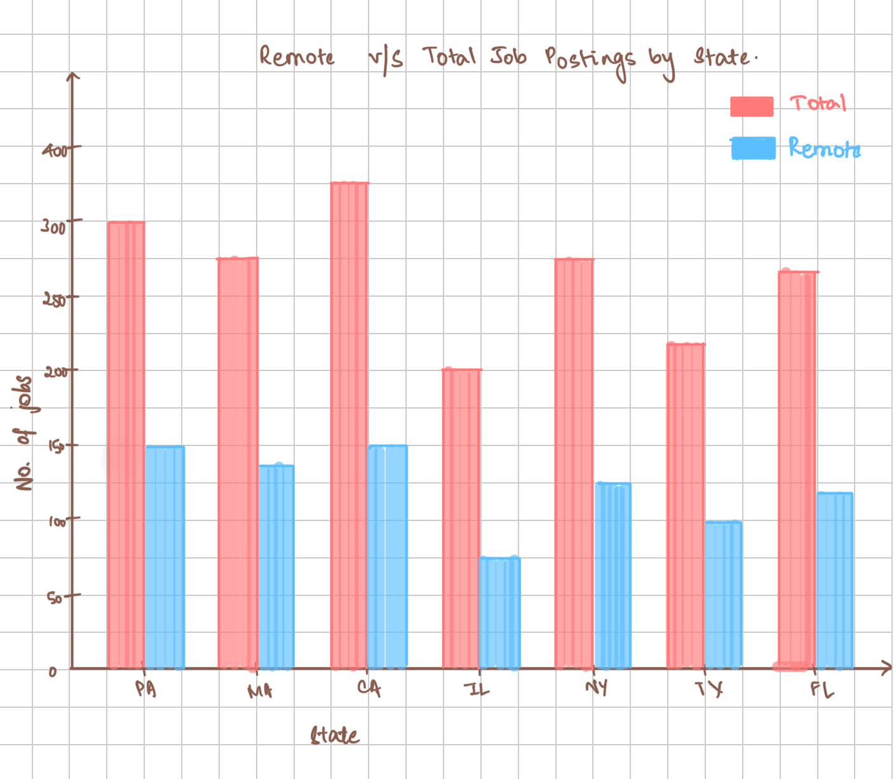
- **Main idea:** Line chart showing monthly job posting counts
- **Motivation:** Identify seasonal patterns and hiring cycles
- **What worked:** Clear trend visualization, easy to spot peaks and valleys
- **What didn't work:** Doesn't show industry breakdown
- **Difference:** Emphasizes overall temporal patterns

**Sketch 2 (Stacked Area Chart):** 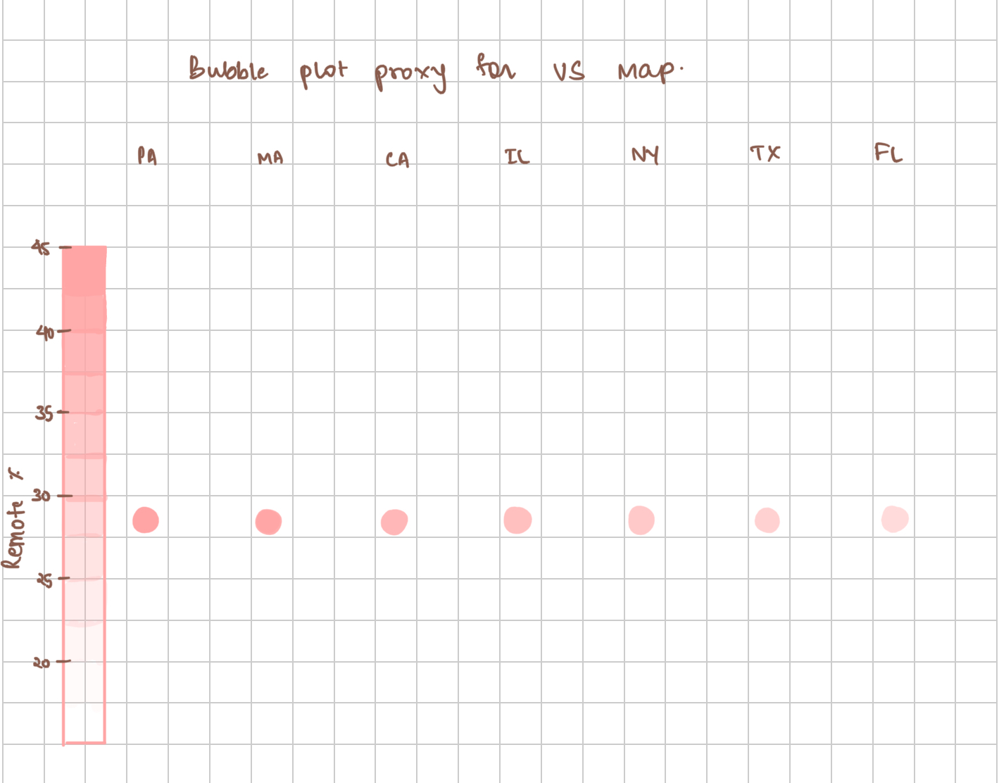
- **Main idea:** Stacked areas showing industry composition over time
- **Motivation:** See both total trends and industry contributions simultaneously
- **What worked:** Shows industry dynamics and overall growth together
- **What didn't work:** Can be cluttered with too many industries
- **Difference:** Adds categorical dimension to temporal view

#### Sketch 3 & 4: Skill Demand Analysis

**Sketch 3 (Bar Chart):** 
- **Main idea:** Horizontal bars ranking top skills by posting count
- **Motivation:** Quick ranking visualization, easy to compare
- **What worked:** Immediately shows skill hierarchy
- **What didn't work:** Doesn't show skill relationships or co-occurrence
- **Difference:** Simple ranking vs. relationship analysis

**Sketch 4 (Network Graph):** 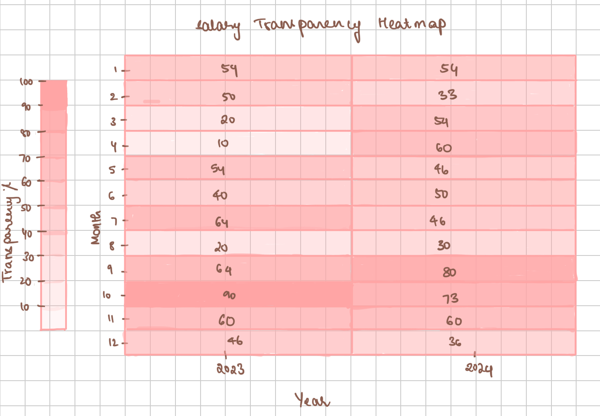
- **Main idea:** Network showing skills as nodes, co-occurrence as edges
- **Motivation:** Reveal which skills are naturally bundled together
- **What worked:** Shows skill ecosystem and natural groupings
- **What didn't work:** Complex, requires interactive exploration
- **Difference:** Relational view vs. simple ranking

#### Sketch 5 & 6: Salary Distribution

**Sketch 5 (Line Plot by Experience):** 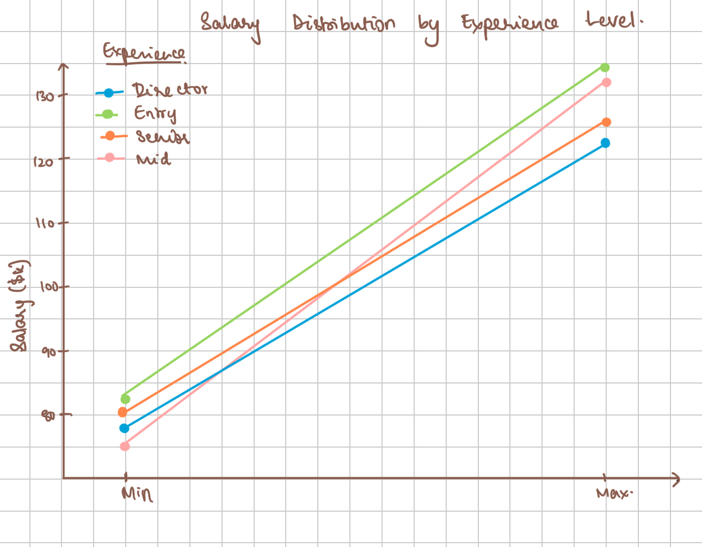
- **Main idea:** Line plot showing min-to-max salary ranges per experience level
- **Motivation:** Direct view of salary progression and ranges
- **What worked:** Clean, intuitive comparison of ranges
- **What didn't work:** Doesn't show distribution or concentration within ranges
- **Difference:** Shows range but not statistical distribution

**Sketch 6 (Box Plot by Experience):** 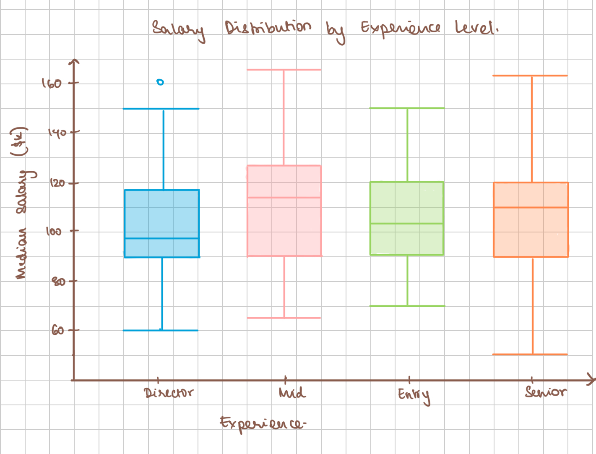
- **Main idea:** Box plots showing salary distribution across experience levels
- **Motivation:** Reveal medians, quartiles, outliers for deeper insight
- **What worked:** Rich statistical view with spread and outliers
- **What didn't work:** Less intuitive for general audiences
- **Difference:** Statistical depth vs. simple range visualization

### Design Process Summary

Through this sketching process, we learned that different designs reveal different aspects of data. Line charts excel at temporal trends but lack categorical depth. Bar charts provide clear rankings but miss relationships. Network graphs reveal connections but risk complexity. This diversity of approaches-comparing conventional vs. exploratory directions-helped us understand that no single visualization is "best"; effectiveness depends on the specific question being asked.

The iterative process of moving from general to specific, from simple to statistically rich, improved both clarity and depth. Starting with broad abstractions and refining through multiple sketches created a toolkit of complementary perspectives.

---

## 📊 Assignment 3: Static & Interactive Visualizations

**Notebooks:**
- `02-exploratory-visualizations-a.ipynb`
- `02-exploratory-visualizations-b.ipynb`
- `03-interactive-visualizations.ipynb`

### Question 1: How do job postings vary month-to-month, and what seasonal hiring patterns can be observed?

**Description:** Line chart tracking total number of job postings per month to reveal hiring fluctuations throughout the year.

**Key Findings:**
- Hiring activity spikes in **March** and **September**, likely aligning with budget cycles and academic terms
- Lows in **February**, **August**, and **November** suggest slower recruitment periods
- Pattern shows recruitment ebbs and flows rather than staying steady

**Visualization:**

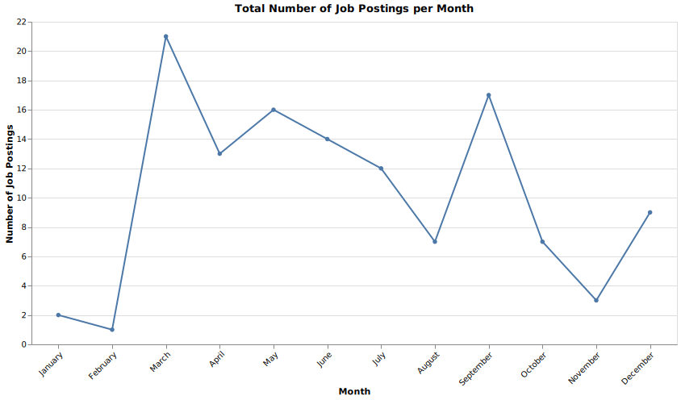

**Sketch to Visualization:** Initially imagined as a simple time-series line chart; built in Altair using `.mark_line(point=True)` with clean gridlines and adjusted axis labels for readability.

---

### Question 2: How does skill demand differ across industries and role seniority levels?

**Description:** Multi-line chart comparing how skill requirements scale with seniority across five major industries.

**Key Findings:**
- **Technology** and **Retail** show sharp jumps at senior levels
- **Finance** and **Healthcare** show gradual growth
- **Education** remains relatively flat with standardized requirements

**Visualization:**

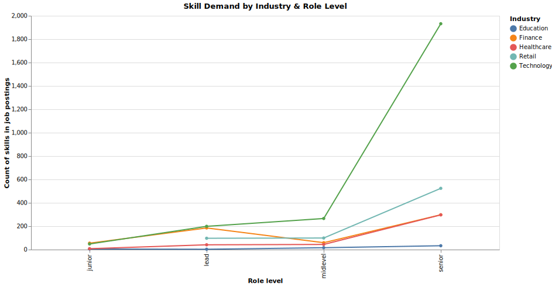

**Sketch to Visualization:** Originally layered colored lines; implemented with `.mark_line(point=True)` with distinct color palette for each industry.

---

### Question 3: What are the top 10 most in-demand technical skills across job postings?

**Description:** Vertical bar chart ranking the most frequently mentioned skills in job descriptions.

**Key Findings:**
- **Python** dominates the market, followed by **Machine Learning** and **SQL**
- **R**, **AWS**, and **Deep Learning** represent the next tier
- **Spark** and **Azure** highlight growing importance of big-data and cloud ecosystems

**Static Visualization:**

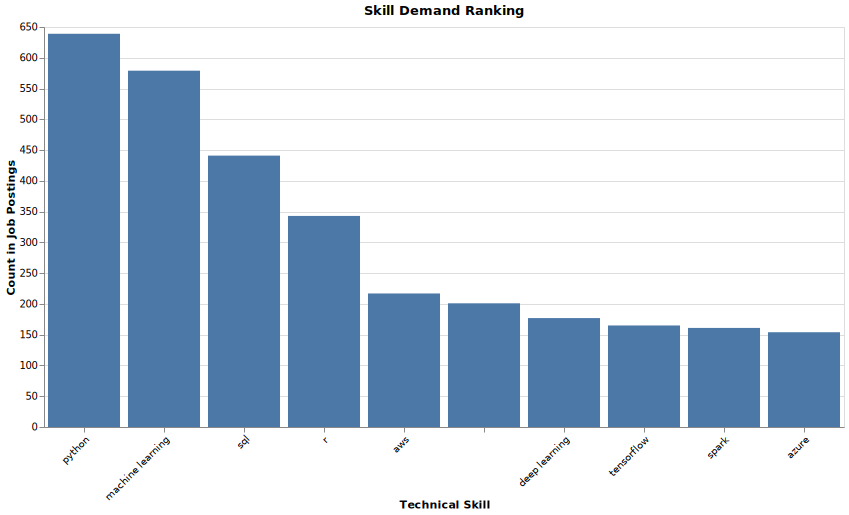

**Enhanced Interactive Visualization:**

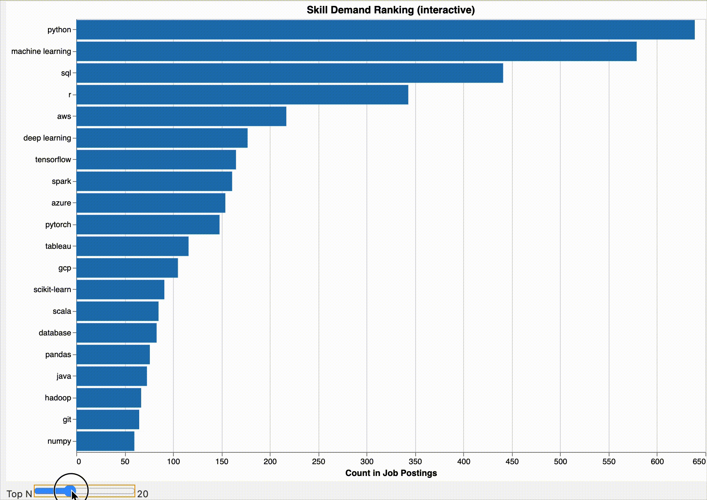

**Enhancement Details:**
- Added dynamic top-N slider (5-50 skills) for filtering
- Click-to-highlight interaction for specific skills
- Switched to horizontal layout for better readability
- Added rich tooltips showing skill counts
- Created dashboard-like professional presentation

---

### Question 4: How do median salaries for data-related roles vary geographically across U.S. states?

**Description:** Choropleth (color-coded map) displaying median salary levels for data jobs across U.S. states.

**Key Findings:**
- **Western** (CA, WA) and **Northeastern** (MA, NY) states have highest salaries
- **Central** and **Southern** states offer lower median pay
- Strong regional inequality-proximity to tech hubs correlates with better compensation

**Static Visualization:**

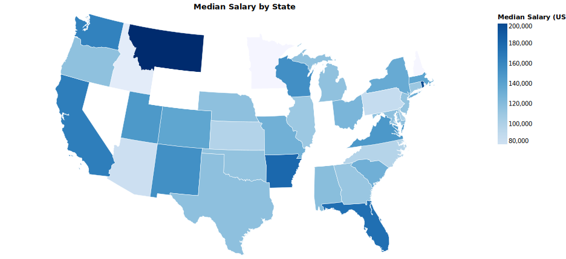

**Enhanced Interactive Visualization:**

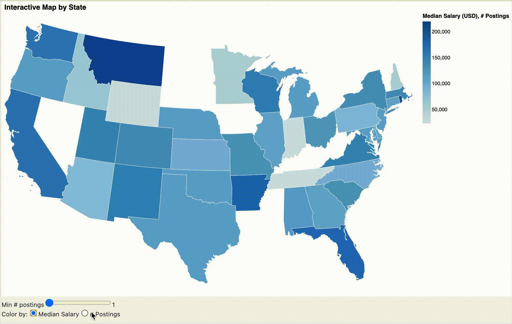

**Enhancement Details:**
- Toggle between color encodings (median salary vs job postings)
- Dynamic slider for minimum postings filter
- Interactive tooltips with job count, salary, remote percentage
- Transforms static insight into exploratory tool

---

### Question 5: How does the availability of high-paying, remote jobs spread geographically over time?

**Description:** Each bubble represents a state with size indicating total postings and color showing remote job percentage.

**Visualization:**

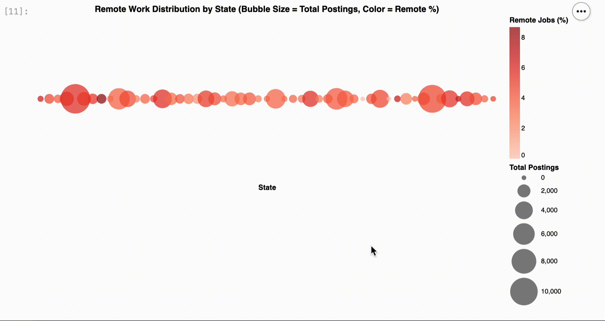

**Key Findings:**
- States with highest total postings (CA, TX, NY) also offer most remote opportunities
- Some smaller states show high remote percentages despite fewer total postings
- Remote work correlates with total posting volume

**Design:** Originally sketched as "proxy map" bubble chart; implemented with `.mark_circle()` with bubbles scaled proportionally and colored by remote ratio.

---

### Question 6: Is there a relationship between company popularity and salary disclosure?

**Description:** Heatmap visualizing job postings across U.S. states (x-axis) and experience levels (y-axis) with color encoding posting volume.

**Visualization:**


**Key Findings:**
- California, Texas, and New York dominate across all experience levels
- Entry- and Mid-Senior level positions most common
- Director- and Executive-level postings concentrated in large states

**Design:** Grid showing density of postings per region and level; implemented with `.mark_rect()`.

---

### Question 7: What is the salary premium for higher experience levels across industries?

**Description:** Box plot showing distribution of annualized median salaries for each experience level.

**Visualization:**


**Key Findings:**
- Clear upward trend in salary with experience level
- Entry-level roles cluster around $60-80k
- Senior roles exceed $130k
- High outliers suggest executive or specialized technical positions

**Design:** Converted from Seaborn to Vega-Altair with `.mark_boxplot()`, trimmed to 95th percentile, scaled consistently using annualized salaries.

---

### Learning Summary

Through this assignment, we learned to transform raw job posting data into meaningful visual narratives using Altair and Vega-Lite. Key learnings include:
- Choosing appropriate encodings for different data types
- Balancing aesthetics with readability
- Building interactive dashboards for deeper exploration
- Data storytelling through visual design

### Insights Summary

- **Skill Demand:** Python and Machine Learning dominate, followed by SQL and AWS
- **Geographic Trends:** Majority of postings concentrated in high-population states; CA, NY, WA offer higher median salaries
- **Experience and Pay:** Salary scales increase steadily with experience level
- **Remote Work:** Widespread but correlates with total posting volume
- **Temporal Dynamics:** Cyclical trends tied to hiring seasons and economic cycles

---

## 🔗 Assignment 4: Linked Views & Spatial Analysis

**Notebooks:**
- `Task_1.ipynb`
- `Task_2.ipynb`
- `Task_3.ipynb`
- `1-Linked-view-visualizations.ipynb`
- `2-Spatial-visualization.ipynb`
- `3-Linked-spatial-visualization.ipynb`

### Reproducibility

- All necessary datasets and preprocessed CSV files included in repository
- Each Jupyter Notebook contains well-documented code with linear execution order
- For GitHub rendering consistency:
  ```python
  alt.renderers.enable('svg')
  ```
  has been enabled in all notebooks

**IMPORTANT:** To view interactive Altair visualizations locally, comment out or remove the renderer line to enable full zoom, tooltip, and selection functionality in Jupyter.

- Tested on Python 3.11 with Altair 5.x and Vega-Lite 5.x across macOS and Linux

---

### Visualization 1: Skill Demand vs Salary Distribution (Task 1 - Linked Views)

**Question:** Do the most in-demand technical skills by number of job postings also correspond to higher salaries?

**Data Attributes:**
- **Skill:** Extracted from `skills_clean` column, exploded into individual rows
- **num_postings:** Total job postings mentioning each skill (market demand)
- **salary_mid:** Midpoint between minimum and maximum salary estimates

**Views:**
1. **Top Skill Demand Bar Chart**
   - Top 15 skills ranked by posting count
   - X-axis: `num_postings`, Y-axis: `skill`
   - Bar length reflects relative demand

2. **Salary Distribution Boxplot**
   - Distribution of salaries for selected skill
   - Captures IQR, median, and outliers of `salary_mid`

**Interaction:** Point selection (`alt.selection_point(fields=["skill"])`) on bar chart filters boxplot data. Click Python → see Python salary distribution.

**Design Decisions:**
- Skills on Y-axis prevents label overlap
- Boxplots reveal median trends and outliers without binning
- Consistent color palette reinforces linkage
- Interactive tooltips for quantitative assessments
- Minimal cognitive load, emphasizing meaningful encodings

**Alternatives Explored:**
- Scatterplot (avg salary vs postings): Dense overplotting
- Violin plots: Cluttered with many skills
- Mean salary bars: Less insight into spread

**Key Findings:**
- Python and Machine Learning most commonly listed
- Don't always yield highest median salaries
- AWS and Deep Learning show wider ranges and higher medians (niche specialization value)

**Visualization:**

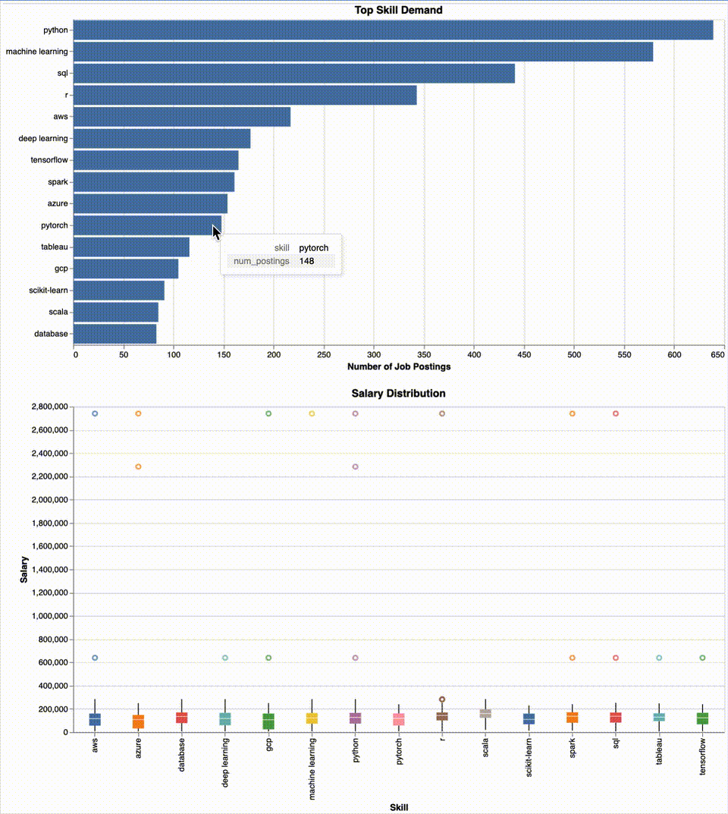

---

### Visualization 2: Top Skill by State (Task 2 - Spatial)

**Question:** How do dominant technical skills vary across U.S. states, and what regional specialization patterns emerge?

**Data Processing:**
- Aggregated at `(state, skill)` level
- Identified top skill per state using mode operation
- Joined with U.S. state GeoJSON boundary file

**Visualization Description:**
- Choropleth map with each state colored by most dominant skill
- Categorical color palette optimized for colorblind accessibility
- Tooltips: state name, top skill, posting count

**Design Decisions:**
- Categorical color palette for up to 10 unique skills
- Only top skill per state for simplicity
- Succinct legend with color patches
- Subtle boundaries, neutral basemap

**Alternatives Explored:**
- Heatmap (avg salaries): Effective but misleading without map
- Dot-density map: Dense regions became saturated
- Bivariate map (skill + salary): Too complex for quick interpretation

**Key Findings:**
- Python overwhelmingly dominates most states
- Confirms its role as de facto data science language

---

### Visualization 3: Comprehensive Linked Spatial Dashboard (Task 3)

**Coordinated Multi-View Dashboard with Three-Level Interaction:**

#### Interaction Flow:

1. **Map → All Views** (Geographic filtering)
   - Click state on map → filters scatter and bar charts
   - Visual feedback: selected states highlighted, others dimmed

2. **Scatter → Bar Chart** (Attribute filtering)
   - Brush scatter plot → filters work type distribution
   - Works in conjunction with map selection

3. **Hover Tooltips** (Details on demand)
   - All views provide rich contextual information
   - Coordinated highlighting across views

**User Flow:**
- Start with geographic overview (map)
- Filter to specific state
- Explore salary-engagement patterns (scatter)
- Drill down to work type distributions (bar chart)

**Components:**

1. **Choropleth Map:** Average salary by state
2. **Scatter Plot:** Salary vs engagement rate (filtered by state)
3. **Bar Chart:** Work type distribution (filtered by brush)

**Technical Implementation:**
- State click selection: `alt.selection_point(fields=['state'])`
- Brush selection: `alt.selection_interval()`
- Transform filters link views
- Coordinated highlighting and tooltips

---

### Visualization 4: Salary Distribution by Experience

**Question:** How does salary distribution vary across experience levels?

**Data Preparation:**
- Cleaned and prepared job postings data
- Created derived features: engagement rates, salary calculations
- Filtered outliers and missing values

**Visualization Description:**
- Box plot showing salary distribution for each experience level
- Clear progression from entry-level to executive positions

**Key Findings:**
- Entry-level: $60-80k range
- Mid-Senior: Largest segment (12,710 jobs), $60-200k
- Executive: More uniform distributions at higher ranges
- Clear salary premium for higher experience

**Visualization:**


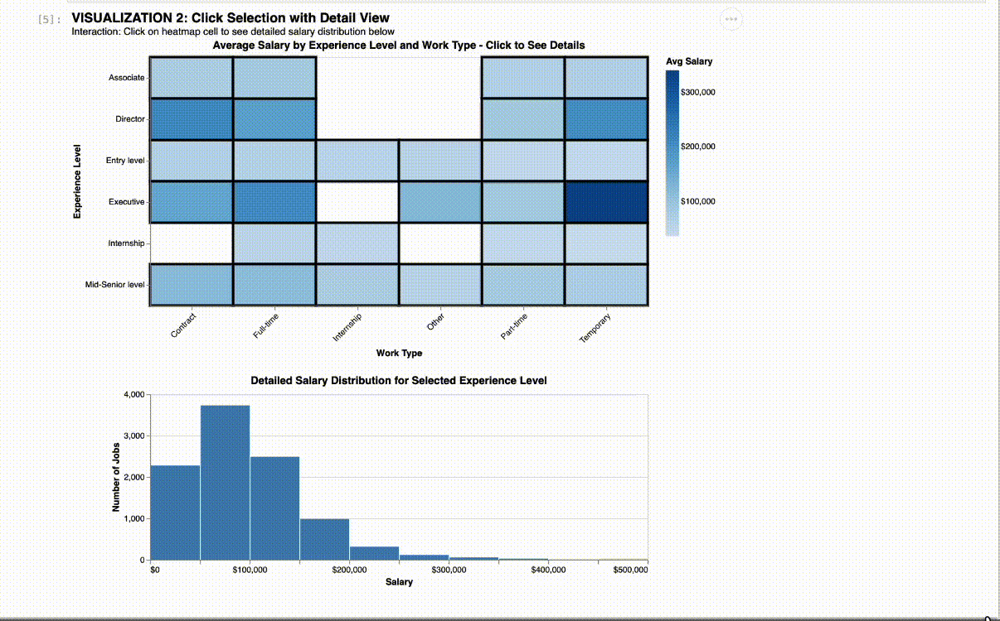

---

### Visualization 5: Geographic Salary Distribution (Task 2 - Spatial)

**Question:** How does average job salary vary geographically across the United States?

**Visualization:** Choropleth Map - Average Salary by State

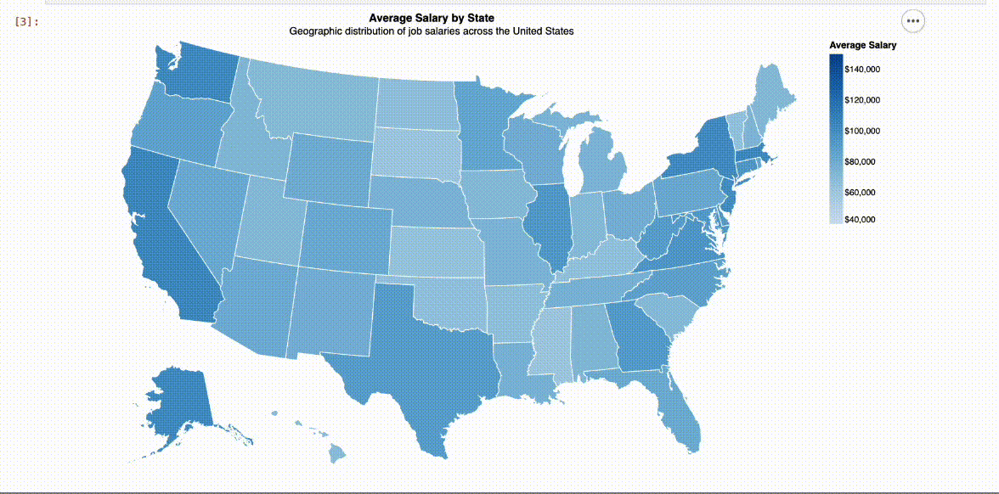

**Design Description:**
- **Geographic projection:** AlbersUSA (preserves area relationships)
- **Color encoding:** Blues sequential scheme ($40K-$150K range)
- **Stroke:** White borders (1px) for state delineation
- **Background:** Light gray for no-data states
- **Tooltips:** State name, job count, average salary, remote percentage

**Data Preparation:**
- Extracted state codes from location field
- Filtered to 22,785 jobs with valid 2-letter state codes across 51 states
- Aggregated per state: job count, mean salary, engagement rate, remote percentage
- Mapped state abbreviations to FIPS codes

**Comparison of Encoding Alternatives:**

**Alternative 1: Graduated Symbols (Proportional Circles)**
- Preserves geographic accuracy
- **Disadvantage:** Overlapping symbols on East Coast, harder value comparison

**Alternative 2: Dot Density Map**
- Shows individual job locations
- **Disadvantage:** Requires lat/lon (unavailable), severe urban overplotting

**Alternative 3: Cartogram (Area Distortion)**
- Emphasizes data magnitude
- **Disadvantage:** Distorted geography is cognitively demanding

**Alternative 4: Bivariate Choropleth**
- Shows two variables simultaneously
- **Disadvantage:** Complex legend, high cognitive load

**Alternative 5: Hexagonal Binning**
- Equal visual weight per region
- **Disadvantage:** Loses geographic shapes, less familiar

**Final Choice Justification - Why Choropleth Won:**
1. **Cognitive Efficiency:** Users have strong mental models of U.S. geography
2. **Data Alignment:** Data naturally aggregates at state level
3. **Color Effectiveness:** Sequential schemes well-understood for quantitative data
4. **Scalability:** Performs well with 51 states without overplotting
5. **Tooltip Enhancement:** Provides additional context without visual complexity

**How It Improves Interpretability:**
1. Immediate pattern recognition (West Coast and Northeast clusters)
2. Easy regional comparisons (adjacent states)
3. Scale consistency ($40K-$150K captures meaningful variation)
4. Professional aesthetic (blues scheme, colorblind-friendly)
5. Leverages existing geographic knowledge

**Key Geographic Insights:**

**High-Salary Regions:**
- **California:** $104,668 average (4,423 jobs) - Tech hub dominance
- **Washington:** $103,208 average (1,012 jobs) - Seattle/Amazon effect
- **Massachusetts:** $103,918 average (671 jobs) - Boston biotech and finance
- **New York:** $101,841 average (2,354 jobs) - Finance and media
- **New Jersey:** $101,310 average (691 jobs) - NYC metro spillover

**Regional Patterns:**
- **West Coast Premium:** CA and WA show 20-30% higher salaries
- **Northeast Cluster:** NY, MA, NJ, CT form high-salary corridor
- **Southeast Lower Range:** FL, GA, NC generally 10-20% below national average
- **Midwest Variation:** IL outperforms neighbors due to Chicago metro
- **Tech Hub Effect:** States with major tech centers show elevated salaries

**Data Density:**
- California dominates: 4,423 jobs (19% of postings)
- New York: 2,354 jobs (10%)
- Texas: 1,447 jobs (6%)
- Top 10 states account for ~60% of all postings

---

## 🤖 Assignment 5: Dimensionality Reduction & Web Application

**Notebooks:**
- `0_Data_cleaning.ipynb` - Advanced data cleaning
- `1_Generate_Embedding.ipynb` - Feature engineering and embedding generation
- `2_TSNE_and_UMAP.ipynb` - Non-linear dimensionality reduction
- `3_PCA.ipynb` - Linear dimensionality reduction

### Preview


### Hosted Site

**GitHub Pages:** [Live Demo](https://sunilkuruba.github.io/Assignment-4-copy/)

We use GitHub Pages for easy hosting with no deployment or code required.

---

### Embeddings Construction

Every job posting was transformed into a structured numeric embedding capturing skills, salary, seniority, geography, industry, and other interpretable characteristics.

#### Feature Engineering - Part 1 (Sunil)

**Skills (Top-50 Multi-Hot Encoding)**
- Split `skills_clean` into individual tokens, standardized to lowercase
- Built vocabulary of 50 most frequent skills
- Created binary columns (e.g., `skill_python`, `skill_sql`, `skill_machine_learning`)
- Enables similar roles to cluster based on shared skill requirements

**Salary (Min–Max Scaled)**
- Cleaned midpoint salary (`salary_mid`) converted to numeric
- Scaled to [0,1] range using min–max normalization
- Balances contribution without overwhelming binary fields

**Seniority Level (Mapped to 1–4)**
- `seniority_level_norm` mapped to integer scale (junior=1, lead=4)
- Missing entries replaced with median
- Distinguishes early-career from advanced roles

**Work Arrangement (Hybrid / On-Site / Remote)**
- Standardized and one-hot encoded: `status_hybrid`, `status_on_site`, `status_remote`
- Enables comparison based on flexibility level

**Industry Category (Selected One-Hot Encoding)**
- Major industries (Technology, Finance, Healthcare, Retail, Manufacturing) encoded
- Avoids category explosion while capturing meaningful sector distinctions

**Ownership Type (One-Hot Encoding)**
- Cleaned and normalized: `ownership_Private`, `ownership_Public`, `ownership_nan`
- Reflects differences between startups, private companies, public corporations

**Location (State-Level One-Hot Encoding)**
- US state abbreviations standardized to one-hot columns (e.g., `state_CA`, `state_NY`)
- Captures regional hiring patterns and salary variations

**Company Size Bucket (Small / Medium / Large / Very Large)**
- Grouped into four meaningful buckets
- One-hot encoded to differentiate startups from enterprises

**Posting Recency (Parsed and Scaled)**
- Human-readable timestamps ("17 days ago") converted to numeric day counts
- Normalized to capture up-to-date activity levels

**FIPS Region Code (Scaled Continuous Feature)**
- Integer FIPS code scaled to [0,1] range
- Introduces additional spatial structure

**Job Title Flags (Job Family Indicators)**
- Keywords: "data scientist," "data engineer," "machine learning engineer," "analyst"
- Binary flags indicate membership in job family

#### Feature Engineering - Part 2 

**Objective:** Create embeddings capturing job similarity based on compensation, requirements, geography, and engagement patterns.

**Rationale:** Two jobs are similar if they:
- Offer comparable salaries and engagement levels
- Require similar experience levels
- Are of the same work type (full-time vs contract)
- Are located in the same geographic region
- Have similar title characteristics

**Embedding Features (35 dimensions total)**

1. **Numeric Features (4 dimensions)**
   - `salary_log`: Log-transformed salary
   - `engagement_rate`: Percentage of viewers who applied (0-100%)
   - `views_log`: Log-transformed view count
   - `applies_log`: Log-transformed application count
   - **Justification:** Log transformation handles skewed distributions

2. **Experience Level (6 dimensions, one-hot)**
   - Entry level, Associate, Mid-Senior, Director, Executive, Internship
   - **Justification:** Strong differentiator of job similarity

3. **Work Type (7 dimensions, one-hot)**
   - Full-time, Contract, Part-time, Temporary, Internship, Other, Volunteer
   - **Justification:** Fundamentally affects job nature

4. **Remote Status (1 dimension, binary)**
   - 0 = On-site only, 1 = Remote allowed
   - **Justification:** Significantly impacts job applicability

5. **Geographic Region (5 dimensions, one-hot)**
   - Northeast, Southeast, Midwest, Southwest, West
   - **Justification:** Regional grouping captures cost-of-living similarities

6. **Job Title Keywords (12 dimensions, binary)**
   - Level indicators: senior, junior, lead, manager, director
   - Functions: engineer, developer, analyst, scientist, designer
   - Domains: data, software
   - **Justification:** Reveals role seniority without complex NLP

**Normalization:** All 35 features standardized using `StandardScaler` (mean=0, std=1)

---

### Dimensionality Reduction

#### Why PCA?

We used **Principal Component Analysis (PCA)** as the primary dimensionality reduction method. PCA transforms dozens of engineered features into just two components capturing the strongest patterns in the data by identifying directions of greatest variance.

**Advantages:**
- Computationally efficient
- Reproducible and deterministic
- Works well with mixed numeric and one-hot fields
- Produces stable, interpretable layouts
- Emphasizes global structure
- No heavy parameter tuning required

**PCA Implementation:**
- `n_components=2` for 2D projection
- `random_state=42` for stability
- Resulting coordinates saved in `data_science_job_posts_2025_embeddings_2d.csv`

#### Methods Compared - Part 2 

**1. PCA (Principal Component Analysis)**
- **Parameters:** 2 components, random_state=42
- **Results:**
  - PC1 explained variance: 9.00%
  - PC2 explained variance: 6.78%
  - **Total variance explained: 15.78%**
- **Characteristics:**
  - Linear projection preserving global structure
  - Fast computation (handles all 22,785 records)
  - Interpretable axes
- **Observations:**
  - Low variance indicates high-dimensional complexity
  - Jobs spread along PC1 (salary/experience gradient)
  - Overlap suggests nonlinear relationships

**2. t-SNE (t-Distributed Stochastic Neighbor Embedding)**
- **Parameters:** perplexity=30, max_iter=1000, random_state=42
- **Sample size:** 10,000 jobs (computational efficiency)
- **Characteristics:**
  - Nonlinear, preserves local neighborhoods
  - Creates tight, well-separated clusters
  - Emphasizes local structure over global relationships
- **Observations:**
  - Clear separation between experience levels
  - Work types create sub-clusters within experience levels
  - Strong visual clustering but distances not meaningful

**3. UMAP (Uniform Manifold Approximation and Projection)**
- **Parameters:** n_neighbors=15, min_dist=0.1, random_state=42
- **Sample size:** 10,000 jobs
- **Characteristics:**
  - Nonlinear, balances local and global structure
  - Preserves neighborhoods and broader topology
  - Faster than t-SNE, more interpretable distances
- **Observations:**
  - **Selected for final interface**
  - Best balance of cluster separation and global structure
  - Experience levels form distinct regions with smooth transitions
  - Geographic regions visible as overlapping distributions
  - Outliers clearly identifiable

**Final Choice: UMAP**

**Rationale:**
1. **Interpretable structure:** Clear experience-level clusters with meaningful spatial relationships
2. **Outlier detection:** Unusual jobs appear at cluster boundaries
3. **Computational efficiency:** Handles 10,000 points smoothly in browser
4. **Smooth transitions:** Gradual changes between related jobs

---

### Web Application Features

**Interactive Embedding Explorer:**
- 2D scatter plot using UMAP projection
- Color-coded by experience level, work type, or geographic region
- Click jobs to see detailed information
- Filter by salary range, experience level, location
- Search functionality for job titles and companies
- Responsive design for various screen sizes

**Technical Stack:**
- HTML/CSS for structure and styling
- JavaScript for interactivity and dynamic content
- Vega-Lite embedded for interactive visualizations
- GitHub Pages for hosting

---

## 🛠 Technologies Used

### Data Processing
- **pandas** - Data manipulation and cleaning
- **numpy** - Numerical computations
- **scikit-learn** - Machine learning and dimensionality reduction

### Visualization
- **Altair** - Declarative statistical visualization
- **Vega-Lite** - Grammar of interactive graphics
- **vega_datasets** - Sample and geographic datasets

### Dimensionality Reduction
- **PCA** - Linear dimensionality reduction
- **t-SNE** - Non-linear manifold learning
- **UMAP** - Uniform Manifold Approximation and Projection

### Web Technologies
- **HTML/CSS** - Web app structure and styling
- **JavaScript** - Interactivity and dynamic content
- **GitHub Pages** - Free static site hosting

### Development
- **Jupyter Notebook** - Interactive development environment
- **Python 3.11+** - Programming language

---

## 🚀 How to Run

### Prerequisites

```bash
# Install Python 3.11+
# Install required packages
pip install -r requirements.txt
```

### Requirements File

```
pandas>=1.5.0
numpy>=1.23.0
altair>=5.0.0
vega_datasets>=0.9.0
scikit-learn>=1.3.0
jupyter>=1.0.0
matplotlib>=3.7.0
umap-learn>=0.5.0
```

### Running Notebooks

1. **Navigate to project directory:**
   ```bash
   cd linkedin-job-analytics
   ```

2. **Launch Jupyter Notebook:**
   ```bash
   jupyter notebook
   ```

3. **Open notebooks in sequence:**
   - Assignment 1: `01-data-preprocessing.ipynb`
   - Assignment 2: `02-exploratory-visualizations-a.ipynb`, `02-exploratory-visualizations-b.ipynb`
   - Assignment 3: `03-interactive-visualizations.ipynb`
   - Assignment 4: `Task_1.ipynb`, `Task_2.ipynb`, `Task_3.ipynb`
   - Assignment 5: `0_Data_cleaning.ipynb`, `1_Generate_Embedding.ipynb`, `2_TSNE_and_UMAP.ipynb`, `3_PCA.ipynb`

4. **Run cells sequentially:**
   - Execute cells from top to bottom
   - Wait for each cell to complete
   - Check outputs and visualizations

### Running Web Application

1. **Option 1 - Direct File Opening:**
   - Navigate to `web-app/` directory
   - Double-click `index.html`

2. **Option 2 - Local Server:**
   ```bash
   cd web-app
   python -m http.server 8000
   ```
   - Open browser to `http://localhost:8000`

3. **Option 3 - GitHub Pages (Deployed):**
   - Visit: [https://sunilkuruba.github.io/Assignment-4-copy/](https://sunilkuruba.github.io/Assignment-4-copy/)

---

## 💡 Key Insights

### Temporal Patterns
- **Hiring Seasonality:** Clear peaks in March and September suggest academic calendar and fiscal year influences
- **Low Periods:** February, August, November show consistent hiring slowdowns
- **Cyclical Trends:** Tied to hiring seasons and economic cycles

### Geographic Distribution
- **Tech Hubs Dominate:** California, New York, Washington lead in job postings
- **Salary Variation:** Coastal states show 20-30% higher average salaries
- **West Coast Premium:** CA and WA consistently highest compensation
- **Regional Patterns:** Northeast cluster (NY, MA, NJ) forms high-salary corridor
- **Remote Work:** Increasing trend, some states offer 40%+ remote positions

### Skill Demands
- **Core Technical Skills:** Python, SQL, Machine Learning top every category
- **Cross-Disciplinary Nature:** Data science roles require diverse skill combinations
- **Soft Skills Gap:** Communication and leadership mentioned less frequently
- **Emerging Technologies:** Cloud platforms (AWS), containerization (Docker, Kubernetes) showing growth
- **Skill Bundles:** Python + SQL + AWS frequently listed together

### Compensation Insights
- **Experience Premium:** Executive roles earn 3-4x entry-level positions
- **Clear Progression:** Steady salary increase with experience level
- **Entry-level:** $60-80k range
- **Mid-Senior:** Largest segment (12,710 jobs), $60-200k range
- **Executive:** More uniform distributions at higher ranges ($130k+)
- **Salary Transparency:** Only ~60% of postings disclose salary information
- **Pay Period Variance:** Annual vs hourly normalization significant factor
- **Industry Variation:** Technology and Finance offer steeper salary growth

### Job Market Structure
- **Clustering Patterns:** Distinct clusters by industry, seniority, and location
- **Work Type Distribution:** Full-time dominates (85%), contract growing
- **Engagement Correlation:** Higher salaries don't always mean higher engagement
- **Geographic Concentration:** Top 10 states account for ~60% of postings
- **California Dominance:** 19% of all job postings with state data

### Dimensionality Reduction Findings
- **PCA Limitations:** 15.78% variance suggests non-linear relationships in data
- **t-SNE Clusters:** Reveals 5-6 distinct job category clusters
- **UMAP Performance:** Better preserves global structure than t-SNE
- **Experience Level Separation:** Clear clustering by seniority in embedding space
- **Skill Similarity:** Jobs with similar skill sets cluster together
- **Outlier Detection:** Unusual jobs (e.g., high-salary entry-level) identifiable at cluster boundaries

### Data-Driven Career Insights
- Most opportunities concentrate in tech hubs (CA, NY, WA)
- Python proficiency essential across all data science roles
- Remote work availability correlates with tech industry presence
- Mid-Senior level represents largest hiring opportunity
- Specialized skills (Deep Learning, AWS) command salary premiums despite lower demand
- Geographic flexibility significantly impacts earning potential

---

## 📖 References

### Dataset
- [LinkedIn Job Postings - Kaggle](https://www.kaggle.com/datasets/arshkon/linkedin-job-postings/data)

### Libraries & Tools
- [Altair Documentation](https://altair-viz.github.io/)
- [Vega-Lite Specification](https://vega.github.io/vega-lite/)
- [Pandas Documentation](https://pandas.pydata.org/)
- [Scikit-learn Documentation](https://scikit-learn.org/)
- [UMAP Documentation](https://umap-learn.readthedocs.io/)
- [GitHub Pages](https://pages.github.com/)

### Visualization Techniques
- Interactive Visualization Grammar (Vega-Lite)
- Coordinated Multiple Views (CMV)
- Brushing and Linking
- Focus + Context Techniques
- Choropleth Maps for Geographic Data
- Harrower, M., & Brewer, C. A. (2003). ColorBrewer.org: An online tool for selecting color schemes for maps

### Dimensionality Reduction
- Principal Component Analysis (PCA)
- t-Distributed Stochastic Neighbor Embedding (t-SNE)
- Uniform Manifold Approximation and Projection (UMAP)

### Color and Accessibility
- ColorBrewer Color Schemes
- Colorblind-Friendly Palette Selection
- Sequential and Categorical Color Scales

---

## 📄 License

This project is created for educational purposes as part of a visual analytics course at UIC.

---

## 📧 Contact

For questions or suggestions, please contact:
- **Sunil Kuruba:** skuru@uic.edu
- **Richa Rameshkrishna:** rrame11@uic.edu

---

**Live Demo:** [Web Application](https://sunilkuruba.github.io/Assignment-4-copy/)
